# Phase 4: Testing Guide - Driving School Lesson Manager

## 📋 Overview

This guide covers unit tests, integration tests, and automated test execution in the CI/CD pipeline with feedback mechanisms.

---

## 🧪 Test Structure

```
tests/
├── setup.js                    # Global test setup and configuration
├── unit/
│   ├── app-factory.js         # Test app factory for creating test instances
│   ├── lessons.test.js        # Lessons API endpoint tests
│   ├── students.test.js       # Students API endpoint tests
│   ├── instructors.test.js    # Instructors API endpoint tests
│   └── health.test.js         # Health check endpoint tests
└── integration/
    └── workflows.test.js       # Complete workflow integration tests
```

---

## 📊 Coverage Thresholds

```javascript
// jest.config.js
coverageThreshold: {
  global: {
    branches: 70,      // 70% branch coverage
    functions: 70,     // 70% function coverage
    lines: 70,         // 70% line coverage
    statements: 70     // 70% statement coverage
  }
}
```

---

## 🚀 Running Tests Locally

### Install Dependencies

```bash
npm install
```

### Run All Tests

```bash
# Run all tests with coverage
npm test

# Run all tests with detailed output
npm run test:all
```

### Run Specific Test Suites

```bash
# Unit tests only
npm run test:unit

# Integration tests only
npm run test:integration

# CI environment setup
npm run test:ci
```

### Watch Mode (Development)

```bash
# Run tests in watch mode
npm run test:watch
```

### Coverage Reports

```bash
# Generate and view coverage
npm run test:coverage

# Coverage report location: ./coverage/index.html
```

---

## 📝 Test Categories

### Unit Tests

Unit tests verify individual API endpoints in isolation:

#### **Lessons Tests** (`tests/unit/lessons.test.js`)

```javascript
describe('Lessons API Endpoints', () => {
  // GET /api/lessons tests
  // - Empty lessons array
  // - Pagination
  // - Status filtering
  
  // POST /api/lessons tests
  // - Create with valid data
  // - Missing required fields validation
  // - Default status assignment
  
  // PUT /api/lessons/:id tests
  // - Update existing lesson
  // - 404 for non-existent lesson
  
  // DELETE /api/lessons/:id tests
  // - Delete existing lesson
  // - 404 handling
});
```

#### **Students Tests** (`tests/unit/students.test.js`)

```javascript
describe('Students API Endpoints', () => {
  // GET /api/students tests
  // - Empty list
  // - Pagination
  
  // POST /api/students tests
  // - Create with valid data
  // - Validation
  // - Default values
});
```

#### **Instructors Tests** (`tests/unit/instructors.test.js`)

```javascript
describe('Instructors API Endpoints', () => {
  // GET /api/instructors tests
  // - Empty list
  // - Pagination
  
  // POST /api/instructors tests
  // - Create with valid data
  // - Validation
  // - Default values
});
```

#### **Health Check Tests** (`tests/unit/health.test.js`)

```javascript
describe('Health Check Endpoints', () => {
  // GET /health tests
  // - Healthy status
  // - Valid timestamp
  
  // GET /ready tests
  // - Ready status
});
```

### Integration Tests

Integration tests verify complete workflows:

#### **Workflows** (`tests/integration/workflows.test.js`)

```javascript
describe('Integration Tests - Full Workflows', () => {
  // Complete Lesson Booking Workflow
  // - Create student, instructor, schedule lesson
  // - Verify data consistency
  
  // Lesson Lifecycle
  // - Schedule → In-Progress → Complete
  
  // Report Generation
  // - Create lessons and generate reports
  
  // Error Recovery
  // - Handle cascading errors gracefully
});
```

---

## 🔄 CI/CD Integration

### Automated Test Pipeline

The CI pipeline (`.github/workflows/ci-phase4.yml`) executes:

1. **Linting** - Code quality checks (ESLint, Prettier)
2. **Unit Tests** - Individual endpoint tests with coverage
3. **Integration Tests** - Complete workflow validation
4. **All Tests** - Full test suite with coverage reporting
5. **Build** - Docker image creation
6. **Security** - Vulnerability scanning
7. **Notifications** - Slack/PR feedback

### Pipeline Flow

```mermaid
graph LR
    A[Code Push] --> B[Lint]
    B --> C[Unit Tests]
    B --> D[Integration Tests]
    C --> E[All Tests + Coverage]
    D --> E
    E --> F[Build Docker]
    F --> G[Security Scan]
    E --> H[Notifications]
    G --> H
    H --> I{Pass?}
    I -->|Yes| J[✅ Success]
    I -->|No| K[❌ Failure]
```



---

## 📢 Notifications & Feedback

### Slack Integration

Configure Slack notifications by setting `SLACK_WEBHOOK` secret:

```bash
# GitHub Settings → Secrets → Actions
SLACK_WEBHOOK=https://hooks.slack.com/services/YOUR/WEBHOOK/URL
```

**Slack Message Includes:**
- Build status (✅ Success / ❌ Failure)
- Job results (Lint, Unit Tests, Integration Tests, Build, Security)
- Repository and branch information
- Commit SHA and author

### Pull Request Comments

The pipeline automatically comments on PRs with:
- ✅ Test coverage report
- 📊 Coverage summary
- 🔍 CI/CD results table
- Overall status indicator

### Email Notifications

GitHub Actions automatically sends email notifications for:
- Pipeline failures
- Pull request reviews required
- Workflow completion

---

## 🎯 Test Examples

### Example: Creating and Testing a Lesson

```javascript
test('should complete lesson workflow: schedule -> execute -> mark complete', async () => {
  // 1. Create student
  const student = await request(app)
    .post('/api/students')
    .send({ name: 'Charlie', email: 'charlie@test.com' });

  // 2. Create instructor
  const instructor = await request(app)
    .post('/api/instructors')
    .send({ name: 'Diana', email: 'diana@test.com' });

  // 3. Schedule lesson
  const lesson = await request(app)
    .post('/api/lessons')
    .send({
      studentId: student.body.id,
      instructorId: instructor.body.id,
      date: '2025-12-20',
      duration: 60,
      status: 'scheduled'
    });

  expect(lesson.body.status).toBe('scheduled');

  // 4. Mark as in-progress
  const inProgress = await request(app)
    .put(`/api/lessons/${lesson.body.id}`)
    .send({ status: 'in-progress' });

  expect(inProgress.body.status).toBe('in-progress');

  // 5. Mark as completed
  const completed = await request(app)
    .put(`/api/lessons/${lesson.body.id}`)
    .send({ status: 'completed', notes: 'Great lesson!' });

  expect(completed.body.status).toBe('completed');
});
```

---

## 📈 Coverage Goals

### Phase 4 Targets

| Metric | Target | Status |
|--------|--------|--------|
| Overall Coverage | 70% | ✅ |
| Branch Coverage | 70% | ✅ |
| Function Coverage | 70% | ✅ |
| Line Coverage | 70% | ✅ |
| Statements Coverage | 70% | ✅ |

### View Coverage Report

```bash
npm run test:coverage

# Open coverage report
open coverage/index.html
```

---

## 🐛 Debugging Tests

### Run Single Test File

```bash
npm test -- lessons.test.js
```

### Run Tests Matching Pattern

```bash
npm test -- --testNamePattern="should create"
```

### Verbose Output

```bash
npm test -- --verbose
```

### Stop on First Failure

```bash
npm test -- --bail
```

### Update Snapshots

```bash
npm test -- --updateSnapshot
```

---

## ✅ Quality Gates

The pipeline enforces quality gates:

1. **Coverage Threshold** - Must maintain 70% coverage
2. **Lint Rules** - No ESLint errors (warnings allowed)
3. **Test Success** - All tests must pass
4. **Build Success** - Docker image builds successfully
5. **Security** - No critical vulnerabilities

If any gate fails, the build is rejected.

---

## 🔗 Related Documentation

- [README.md](./README.md) - Project overview
- [QUICK_START.md](./QUICK_START.md) - Getting started guide
- [DEVOPS_ROADMAP.md](./DEVOPS_ROADMAP.md) - Complete DevOps roadmap
- [IMPLEMENTATION_SUMMARY.md](./IMPLEMENTATION_SUMMARY.md) - Phase 1-3 summary

---

## 📞 Support & Troubleshooting

### Tests Failing Locally

```bash
# Clear Jest cache
npm test -- --clearCache

# Reinstall dependencies
rm -rf node_modules package-lock.json
npm install
```

### Coverage Too Low

1. Review coverage report: `open coverage/index.html`
2. Add tests for uncovered lines
3. Update threshold if intentional in `jest.config.js`

### CI Pipeline Failing

1. Check pipeline logs: GitHub Actions → Workflow Run
2. Review specific job failure
3. Run tests locally to reproduce
4. Push fix and create PR for validation

---

## 🚀 Next Steps

- **Phase 5**: Deploy & Monitor
- **Phase 6**: Optimize & Scale
- **Phase 7**: Advanced DevOps Practices
